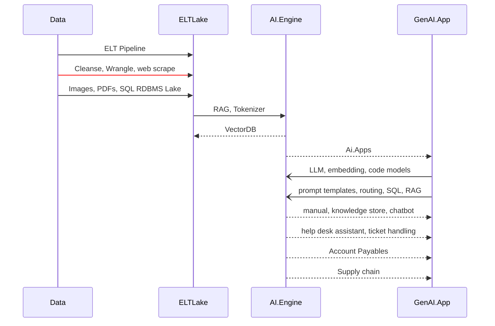
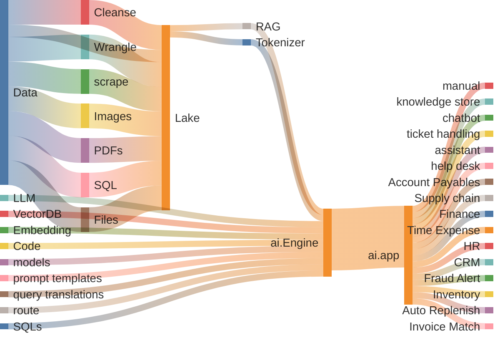

# GenAI Apps

A curated collection of Production GenAI applications, demonstrating their practical impact in real-world scenarios.

**Author:** Amit Shukla

[License Information](https://github.com/AmitXShukla/GenAI/blob/master/LICENSE)

**Connect**

click here to access [Video Tutorials](https://youtube.com/@Amit.Shukla)

## Introduction

I'm excited to introduce my new blog series on **Gen AI RAG driven applications**. We'll be creating practical tools like AI-powered programming manuals, web scraping software, a real-time knowledge base, virtual assistant, and automatic responder app - all running locally on open-source language models.

In this series, you'll gain hands-on experience in constructing high-caliber applications that function seamlessly within your environment, from local development to production deployment.

In this series, we will use open-source models like **Llama 3, Mistral, Phi, Gemma 2** and Lang Chain, or paid APIs like **Claude, Gemini and Open AI**.
These state-of-the-art systems handle complex tasks across languages and modalities while supporting extensive contexts. 
You can host these models locally or on cloud, depending on your business needs.
In this series, you will find individual scripts which are part of a larger microservices architecture, helping us achieve bigger goals by taking small steps forward. We'll use local LLMs and code models, as well as **OLLAMA**, **Lang Chain**, **TAIPY**, **Chroma**, and other technologies that can operate offline without internet connectivity, ensuring your data remains safe and secure within your premises.

Additionally, you will learn to:

1. **Utilize proprietary data** effectively within these applications to ensure confidentiality and tailor solutions specifically to your organization's needs.

2. **Run & Manage models locally** for faster processing times, reducing dependency on cloud services, and enhancing control over the application infrastructure.

3. **Handle multi-modal inputs/outputs**—incorporating textual, visual, and auditory data to create applications capable of more natural human-computer interactions.

4. **Support multiple languages** in your apps, ensuring a broader reach and inclusivity for users worldwide.

5. **Process larger contexts** without performance bottlenecks, allowing the application to maintain high responsiveness even when dealing with extensive amounts of information or complex queries.

We will not cover all of these scenarios and may not in depth as much we wanted to in a real production system, however, we will simulate as much as we can, to perform a quick POC.

**Here is a high level process flow diagram**

This blog series covers every step of building, deploying, and launching a basic app from scratch. Later, we'll apply these skills to more complex projects.

- `Manualify.ai` : is a Smart AI for Answering Questions from Tutorials: Harnessing the Power of RAG LLMs and Documents, knowledge store chatbot assistant
- `HelpDesk.ai` : Revolutionizing Customer Support through Automation
- `AutoResponder.ai` : Streamlining Interactions: An Exploration of Automated Chat Moderation and Command Response Systems, automated ticket handling using Service Now

- `Supply chain assistant`:

    - `Auto Invoicing, Duplicate Invoice Match`: 
        - DocumentBot.ai: 
        - Auto reader
        - Payables, Receivables, Voucher, Invoice, Payment, 
        - Receipts, Guided buying, purchase recommendations, anomaly detection
        - bought together, optimum qty, payment monitoring system
        - 3 way match, match exception analysis, AI interceptor invoice monitoring
		- vendor monitoring and analysis
		- ordering supplies - auto replenishment inventory
        - `Spend Classifier`
        - `Smart Supplier:`
        - `Contract Reader, Validator, Recommender Engine`
        - contractual vs non-contractual spending
        - `Sourcing Procurement Contracts Engine`:
        - `SavingsFinder.ai | Guidedbuying.ai`:
        - `Taxonomy`:
        - `ML4GL` - Finance Statement, Security filings RAG
        - `Time & Expense`: audit time, expense and monitoring for employees

- Embeddings :
    
    - `Anomaly Detection` - Identify Fat Finger Purchases, Invoices and transactions
      
    - `Recommendation engine`: create a local version of "purchased together" items recommendation engine based on internal customer purchase history and promotions.
    
    - `Fraud Alerts`:  Identify and Alert Fat Finger Purchases, Invoices and transactions

- **Other Ideas: (Pro Applications)**

    - `RxPathology.ai | Lab.ai`
        
    - `AutoGrader`: School paper grading, self-study assignment grader
    
    - `LawDocs.ai` case applied , case reference , state vs federal law applied to situation

    - `ParliamentReferences.ai`
    - `KitchenKing.ai`
    - `Namastemovie.ai` - movie reviews
    - `Dreamify.ai`
    - `Astrologify.ai`
    - `TradingAlerts.ai | Tradesmart.ai` - using Fundamental and Technical Analysis, generate leads based on in-house RAG Sec Filings database, Trading alerts news etc.

