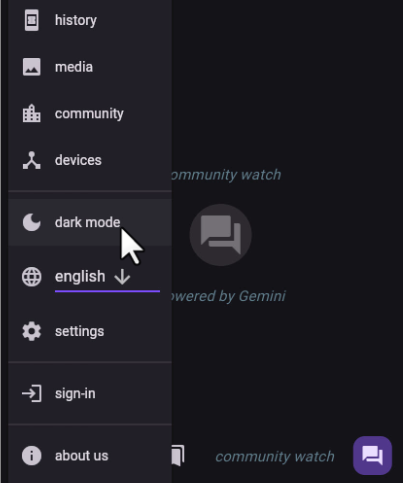

# GenAI Apps

This blog series is for beginners and young Entrepreneurs who want to build **Gen AI RAG driven applications**.

**Author:** Amit Shukla

**Connect**

click here to access [video playlist](https://youtube.com/@Amit.Shukla)

## What you'll learn
Hands on experience to build Gen AI RAG based Pro Apps, running 100% locally/hosted or API based, using API / tools of your choice.
## Tools
		Vector DB: TryChroma, SQLLite, Supabe or any VectorDB of your choice
		Progamming: Python 3.12+
		Application: Ollama WebUI or Taipy or Flutter
		IDE: Jupyter Lab, Ollama
		LLM: Gemini | llama 3.1 | OpenAI ChatGPT | Anthropic | Local models
## Lessons

| #   | Lesson                                       | Source   | video |
| --- | -------------------------------------------- | -------- | ----- |
| 1   | Learning to setup and use LLM                | [notebook](./Manualify/src/Manualify.ipynb) | link  |
| 2   | working with data loader                     | [notebook](./Manualify/src/Manualify.ipynb) | link  |
| 3   | Tokenizer, Embeddings, Vector DB and LLM     | [notebook](./Manualify/src/Manualify.ipynb) | link  |
| 4   | Tools/Function calling                       | [notebook](./Manualify/src/Manualify.ipynb) | link  |
| 5   | building a functioning web app               | [notebook](./Manualify/src/Manualify.ipynb) | link  |
| 6   | Pro APP : Time Expense monitoring automation | notebook | link  |
| 7   | Pro APP: Local OCR Vision AI                 | notebook | link  |
| 8   | Pro APP: Supply Chain monitoring AI          | notebook | link  |
| 9   | Pro APP: Help Desk automation                | notebook | link  |
| 10  | Pro APP: Auto Responder                      | notebook | link  |
| 11  | Appendix - Other use cases                   | notebook | link  |

**Here is a high level process flow diagram**

## Sample App images (end results)

## Appendix: other use cases

This blog series covers every step of building, deploying, and launching a basic app from scratch. Later, we'll apply these skills to more complex projects.

- `Manualify.ai` : is a Smart AI for Answering Questions from Tutorials: Harnessing the Power of RAG LLMs and Documents, knowledge store chatbot assistant
- `HelpDesk.ai` : Revolutionizing Customer Support through Automation
- `AutoResponder.ai` : Streamlining Interactions: An Exploration of Automated Chat Moderation and Command Response Systems, automated ticket handling using Service Now

- `Supply chain assistant`:

    - `Auto Invoicing, Duplicate Invoice Match`: 
        - DocumentBot.ai: 
        - Auto reader
        - Payables, Receivables, Voucher, Invoice, Payment, 
        - Receipts, Guided buying, purchase recommendations, anomaly detection
        - bought together, optimum qty, payment monitoring system
        - 3 way match, match exception analysis, AI interceptor invoice monitoring
		- vendor monitoring and analysis
		- ordering supplies - auto replenishment inventory
        - `Spend Classifier`
        - `Smart Supplier:`
        - `Contract Reader, Validator, Recommender Engine`
        - contractual vs non-contractual spending
        - `Sourcing Procurement Contracts Engine`:
        - `SavingsFinder.ai | Guidedbuying.ai`:
        - `Taxonomy`:
        - `ML4GL` - Finance Statement, Security filings RAG
        - `Time & Expense`: audit time, expense and monitoring for employees

- Embeddings :
    
    - `Anomaly Detection` - Identify Fat Finger Purchases, Invoices and transactions
      
    - `Recommendation engine`: create a local version of "purchased together" items recommendation engine based on internal customer purchase history and promotions.
    
    - `Fraud Alerts`:  Identify and Alert Fat Finger Purchases, Invoices and transactions

- **Other Ideas: (Pro Applications)**

    - `RxPathology.ai | Lab.ai`
        
    - `AutoGrader`: School paper grading, self-study assignment grader
    
    - `LawDocs.ai` case applied , case reference , state vs federal law applied to situation

    - `ParliamentReferences.ai`
    - `KitchenKing.ai`
    - `Namastemovie.ai` - movie reviews
    - `Dreamify.ai`
    - `Astrologify.ai`
    - `TradingAlerts.ai | Tradesmart.ai` - using Fundamental and Technical Analysis, generate leads based on in-house RAG Sec Filings database, Trading alerts news etc.